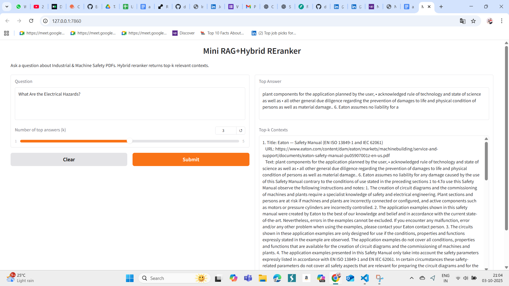

# Mini RAG Project

A small **RAG-based Q&A system** built using **FAISS**, **Sentence Transformers**, and **FastAPI**.  
It allows users to ask questions over a small set of documents and retrieve relevant answers with hybrid retrieval + reranker.

---

## Setup Instructions

1. Clone the repo:  
```bash
git clone https://github.com/divyakp88/mini_rag_project.git
```

2.Create and activate a virtual environment:
```bash
python -m venv rag_env
# Windows
rag_env\Scripts\activate
# Linux/macOS
source rag_env/bin/activate
```
3.Install dependencies:
```bash
pip install -r requirements.txt
```
4.Run the FastAPI app:
```bash
python main.py
```
The API will be available at http://127.0.0.1:7860

## Screenshots
### Response


## What I Learned

Building this RAG project was more than just coding for me — it was a journey of persistence, problem-solving, and rediscovering my own strength.

At first, I struggled with concepts like vector databases, embeddings, FAISS indexing, and integrating them with FastAPI. Many times, errors felt like roadblocks, but I learned to approach them step by step, researching, debugging, and finding solutions on my own.

I realized how important data preprocessing and schema design are, because one small mistake in the database affected my entire pipeline. This taught me patience and attention to detail.

Working with embeddings and reranking gave me a real understanding of how AI can make search smarter. Earlier, these concepts felt abstract, but now I can confidently explain and implement them.

Most importantly, I built confidence in myself — that I can start with zero clarity, break a big task into smaller ones, and finally create something that works end to end, with both backend logic and a frontend interface.

This project is not just code on my laptop — it’s proof that I have the determination to learn, adapt, and deliver results.


